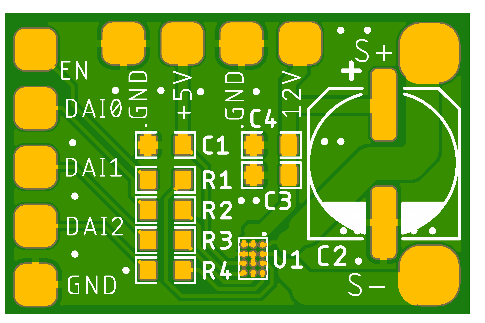
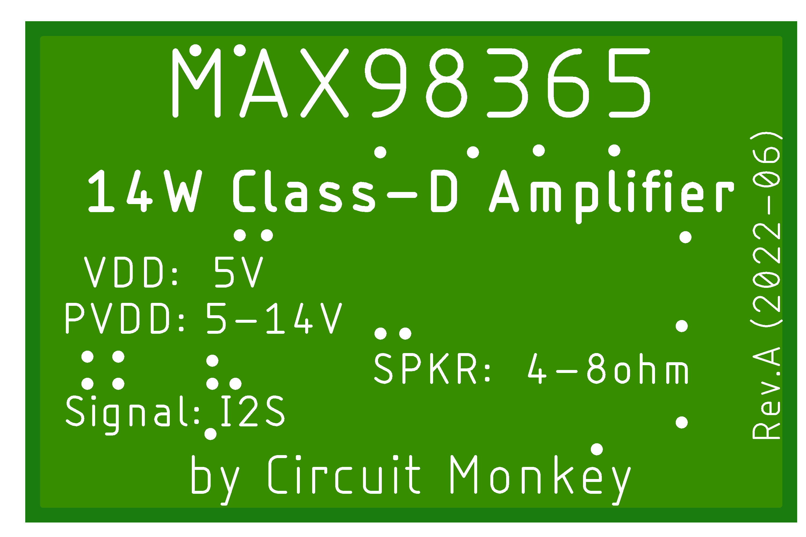

# audio-amp-max98365
Class-D audio amplifier using the Maxim MAX98365.  I2S input, 18W output.

## Features
MAX98365 Class-D Amplifier chip.  14W Max.
Dimensions:  20mm x 13mm
5-14V Supply Voltage
I2S Signal Input

## Images

## See Maxim Datasheet for additional information
[https://datasheets.maximintegrated.com/en/ds/MAX98365.pdf](https://datasheets.maximintegrated.com/en/ds/MAX98365.pdf)
